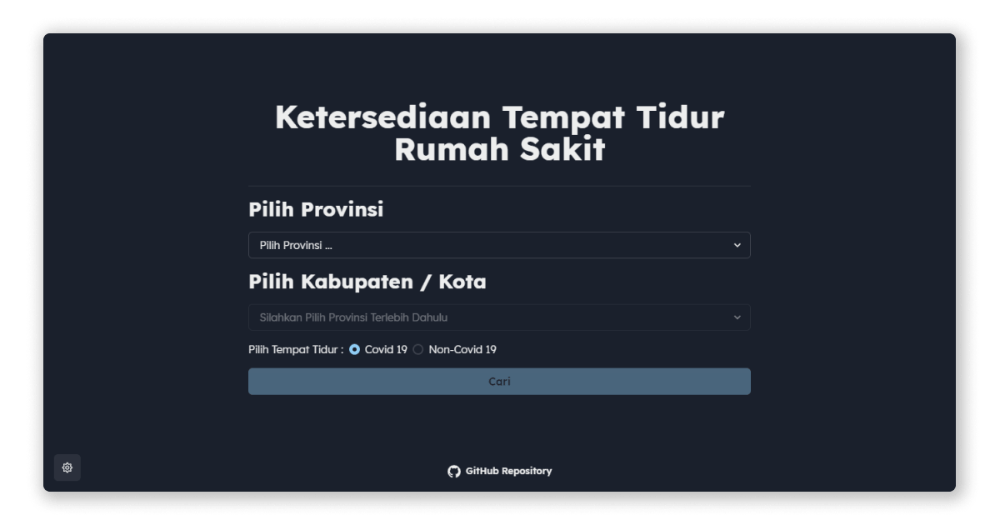

# Bed Covid RS Indonesia



Website ini digunakan sebagai tempat mencari informasi terkait ketersediaan tempat tidur rumah sakit di Indonesia.

## Instalasi

1. Klon repositori ini <br />
   ```
   git clone https://github.com/hendraaagil/bed-covid-rs-indo.git
   ```
2. Unduh semua dependensi <br />
   ```
   yarn
   ```
3. Konfigurasi _file_ `.env` <br />
   ```
   NEXT_PUBLIC_API_URL = ''
   ```
4. Jalankan _project_ <br />
   ```
   yarn dev
   ```

## Teknologi yang digunakan

- [Next.js](https://nextjs.org/)
- [Chakra UI](https://chakra-ui.com/)

Menggunakan _starter template_: [hendraaagil/next-chakra-starter](https://github.com/hendraaagil/next-chakra-starter).

## Sumber data

Sumber data website ini berasal dari publik API: [satyawikananda/rs-bed-covid-indo-api](https://github.com/satyawikananda/rs-bed-covid-indo-api).

## Kontribusi

Jika menemukan _bug_ atau kesalahan silahkan lapor ke _issue_ atau jika ingin berkontribusi silahkan buat _pull request_.

## Referensi

- [Ina Covid Bed](https://github.com/agallio/ina-covid-bed)

---

Kode ini berlisensi di bawah [MIT License](LICENSE).
